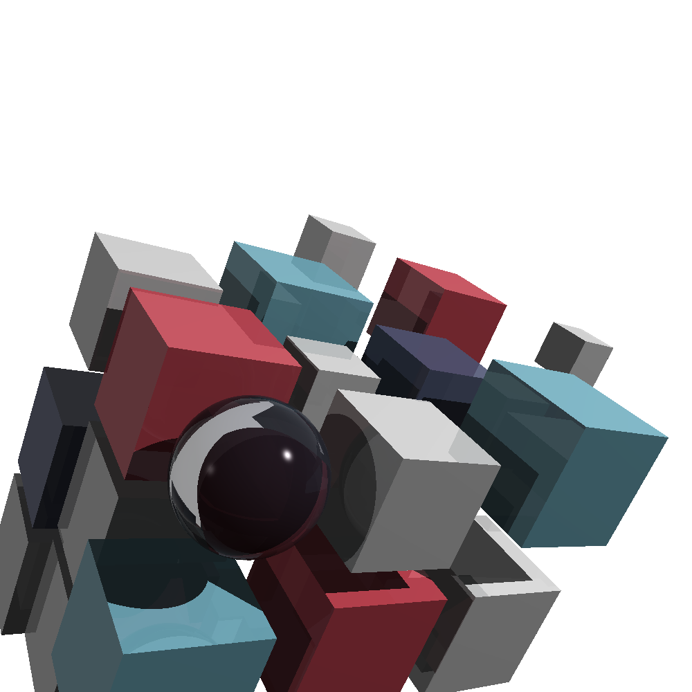
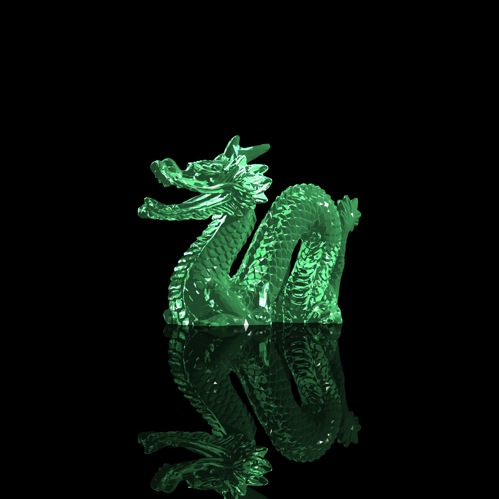
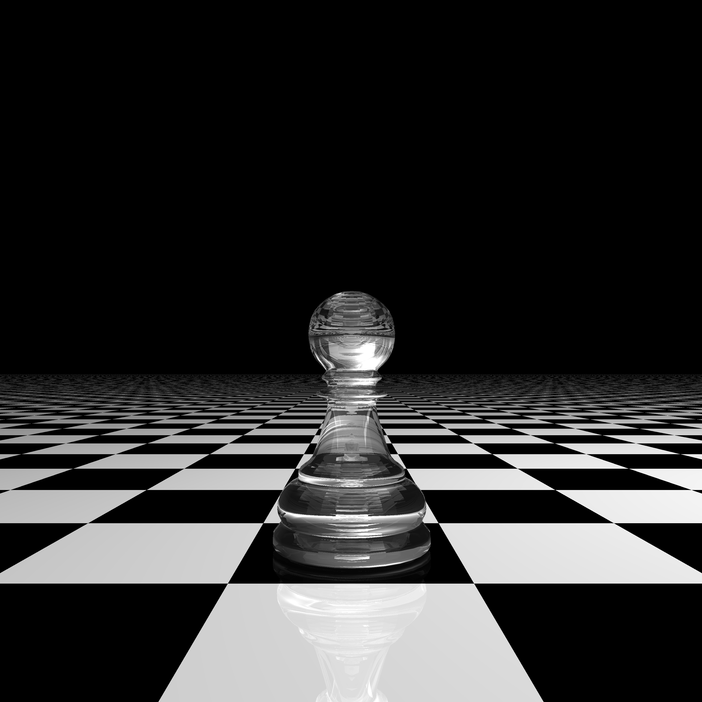
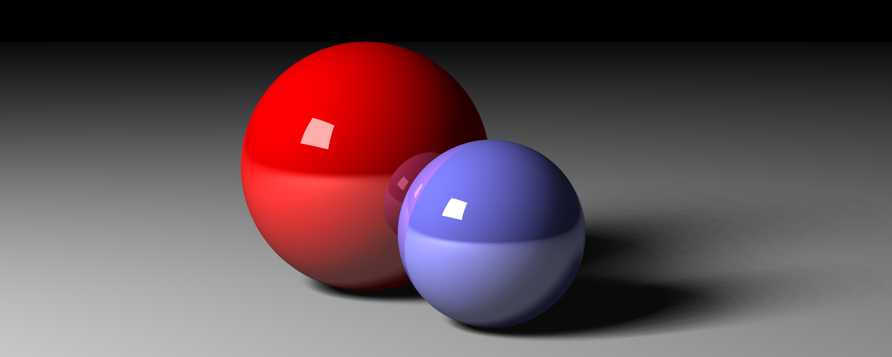

# Ray Tracer

A recursive (Whitted) ray tracer written in C (C11), based on the book _The Ray Tracer Challenge_ by Jamis Buck.

## Features

- **Primitives**: Spheres, planes, cubes, triangles, cylinders, cones
- **Transformations**: Translation, scaling, rotation, shearing
-  **Effects**: Reflection, refraction, transparency, [Fresnel effect](https://en.wikipedia.org/wiki/Fresnel_equations)
- **Patterns**: Gradient, rings, checker
- **Lighting**: [Phong shading](https://en.wikipedia.org/wiki/Phong_shading), point lights, area lights, soft shadows
- [OBJ](https://en.wikipedia.org/wiki/Wavefront_.obj_file) file parser for importing 3D models
- Groups, bounding boxes, [bounding volume hierarchies](https://en.wikipedia.org/wiki/Bounding_volume_hierarchy) (BVH's) for scene acceleration
- OpenMP for multi-threaded rendering
- SIMD-friendly compilation (`-march=native`)

## Renders





 
 

## Building

### Prerequisites

- CMake 3.10 or higher
- Clang 
- OpenMP support

### Instructions

```bash
mkdir build && cd build
cmake .. && make -j8
```

## Usage

Edit `src/main.c` to select which scene to render:

```c
int main(void) 
{  
    scene_cover();
    return 0;
}
```

Rendered images are saved as Portable Pixmap (PPM) files in the `renders/` directory.

## Testing

```bash
cd build && make test
```

## License

MIT License
